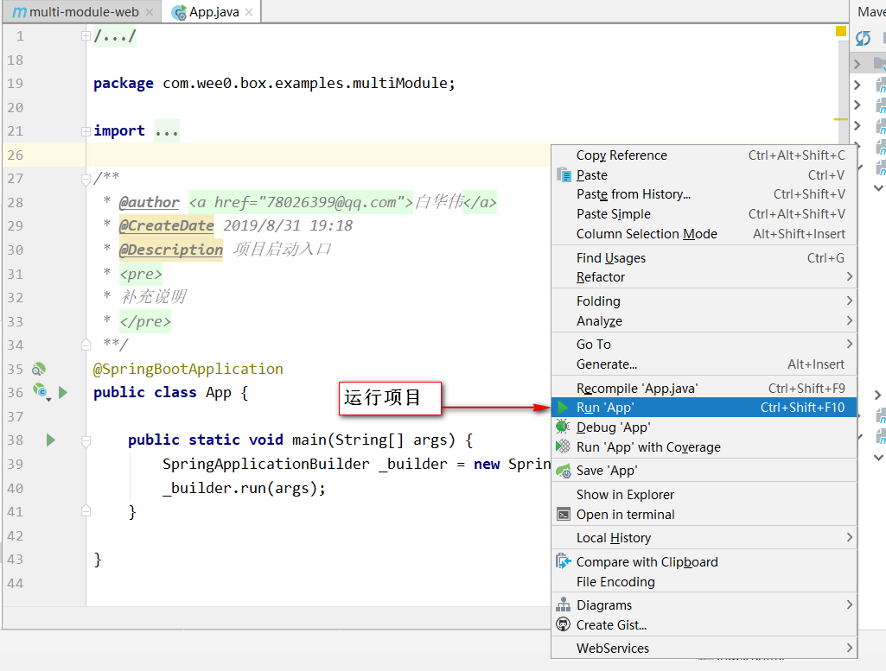

# 快速开始

## 本文档编写时使用的测试环境如下

- Jdk8u181
- Maven3.5.4
- Idea 2019.2.1 开源版
- Mysql 5.7
- 64位windows10

## 本地搭建多模块示例项目开发环境

1. 从Github下载box-examples示例项目。[下载地址](https://github.com/baihw/box-examples/archive/dev.zip) 

2. 解压到本地非中文目录，如：D:/temp/box-examples，解压后的目录如下：

3. 启动Idea，点击“Open”，选择示例项目根目录下的“pom.xml”文件，点击“Open as Project”导入工程。

4. 进入工程后的结构如下：

5. 根据需要使用“scripts/mysql_init.sqll”文件中的脚本，导入数据库初始化数据。

6. 根据本地环境，修改“application-dev.properties”配置文件中的数据库连接信息。

7. 打开“App.java”，右键，运行。

8. 访问 http://127.0.0.1:9000 查看效果吧。

## 本地搭建无模块示例项目开发环境

待补充。

